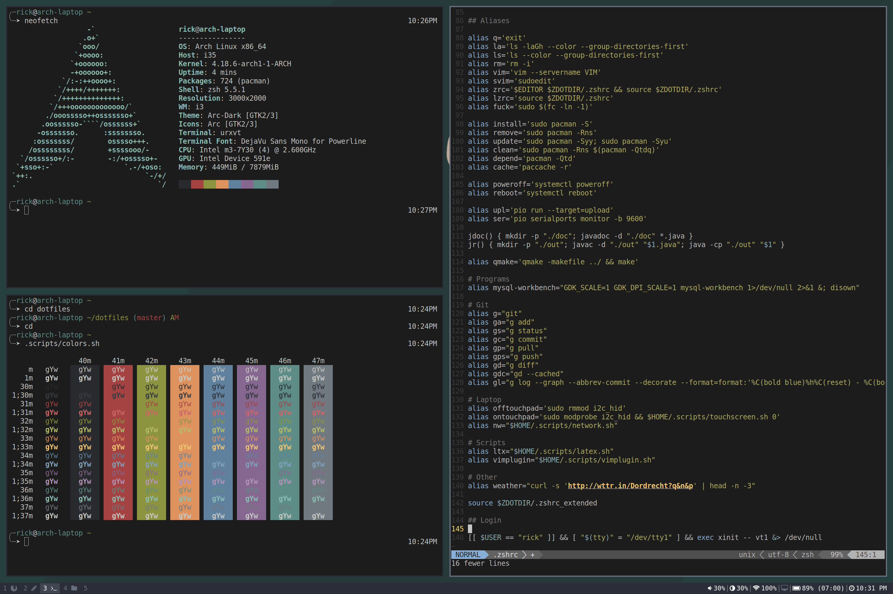

# Dotfiles

This is a collection of dotfiles and scripts for my i3 setup, previewed below:



### Software:

All packages that are manually installed via pacman -S, dependencies not included.

    -- installed during installation
    base
    base-devel
    sudo
    iw
    wpa_supplicant
    dialog
    -- installed after booting into system
    git
    openssh
    pacaur
    xorg-server
    xorg-xinit
    xorg-xrandr
    xorg-xbacklight
    xf86-video-intel
    i3-gaps
    rofi
    feh
    i3blocks
    i3lock-color-git (AUR)
    acpi
    playerctl
    alsa-utils
    sysstat
    screenfetch
    scrot
    imagemagick
    rxvt-unicode
    zsh
    zsh-completions
    libx264
    ttf-dejavu
    firefox
    libnotify
    pulseaudio
    pulseaudio-alsa
    pavucontrol
    thunar
    thunar-volman
    gvfs
    tumbler
    ffmpegthumbnailer
    poppler-glib
    gtk-theme-arc-git (AUR)
    arc-icon-theme-git (AUR)
    moka-icon-theme-git (AUR)
    lxappearance
    ntfs-3g
    exfat-utils
    gedit
    thunderbird
    qbittorrent
    filezilla
    tlp
    smartmontools
    x86_energy_perf_policy
    intel-ucode
    mpv
    youtube-dl
    rtmpdump
    xarchiver
    zip
    unzip
    unrar
    p7zip
    texlive-most
    gvfs-mtp
    gvfs-gphoto2
    chromium
    zathura
    zathura-pdf-mupdf
    python2-setuptools
    python2-click-5.1 (AUR)
    platformio (AUR)
    vim
    checkbashisms (AUR)
    xss-lock-git (AUR)
    inkscape
    cura
    wpa_actiond

### Configuration:

Below are all the system changes that were made.<br>
$ = command<br>
<> = variable<br>
() = action

Predictable network interface names:
```
$ ln -s /dev/null /etc/systemd/network/99-default.link
```
Give wheel users sudo permission:
```sh
$ nano /etc/sudoers
(add)Defaults insults
(uncomment)%wheel ALL=(ALL) ALL
```
Add user:
```sh
$ useradd -m -G wheel -s /bin/bash <username>
$ passwd <username>
```
Installing pacaur:
```sh
$ gpg --recv-keys <pubkey>

$ git clone cower
$ cd cower
$ makepkg -si
$ cd ..

$ git clone pacaur
$ cd pacaur
$ makepkg -si
$ cd ..

$ pacaur -S cower pacaur
$ rm -rf cower pacaur
```
Switch shell to zsh:
```sh
$ chsh -s /bin/zsh
```
Pacman colors:
```sh
$ nano /etc/pacman.conf
(uncomment)Color
```
Git:
```sh
$ git config --global user.email "<email address>"
$ git config --global user.name "<name>"
```
Tlp:
```sh
$ systemctl enable tlp.service
$ systemctl enable tlp-sleep.service

$ nano /etc/default/tlp
(edit)SOUND_POWER_SAVE_ON_BAT=0
```
Trim:
```sh
$ systemctl enable fstrim.timer
```
Clock internet sync:
```sh
$ timedatectl set-ntp true
```
Mail gpg:
```sh
$ gpg --decrypt <backup.pgp> | gpg --import
$ gpg --search-keys <email address>
```
Network:
```sh
$ systemctl enable netctl-auto@wlan0.service
```
Give permission to /dev/ttyUSB0 for PlatformIO:
```sh
$ gpasswd -a <user> uucp
```
